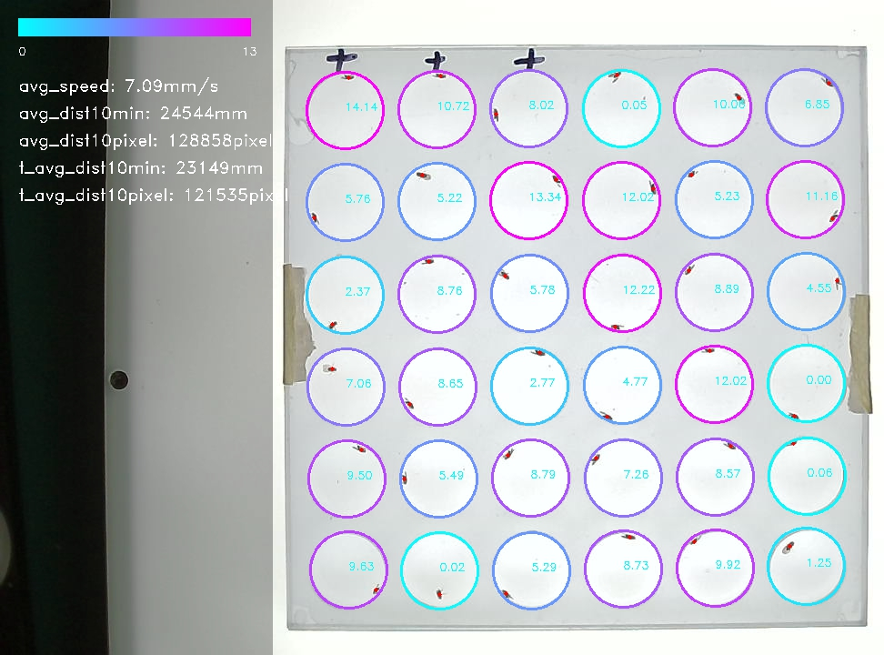

<div align='center'>


</div>


**An easy-to-use program for analyzing Drosophila Activity.**

<div align='center'>


</div>

---

## Features

* 快速的果蝇跟踪

* 支持同时追踪多个腔室的果蝇

* 可自由选择特定的腔室

* 支持分组对比

* babababa

## Installation

#### Online installation

Install the [PyPI package](https://pypi.org/project/easyFlyTracker/):

```commandline
pip install easyFlyTracker
```

or

```commandline
pip install -i https://pypi.org/simple/ easyFlyTracker
```

#### Or local installation

Clone the repository:

```commandline
git clone https://github.com/azzhu/EasyFlyTracker.git
```

or [download and extract the zip](https://github.com/azzhu/EasyFlyTracker/archive/master.zip) into your project folder.

Then install it using the local installation command:

```commandline
python setup.py build
python setup.py install
```

## Usage

程序包含两个命令：

#### easyFlyTracker

* SYNOPSIS
```commandline
easyFlyTracker [config_file_path]
easyFlyTracker -h 
easyFlyTracker --help
```

* DESCRIPTION

babababababba

#### easyFlyTracker_analysis

* SYNOPSIS
```commandline
easyFlyTracker_analysis [config_file_path]
easyFlyTracker_analysis -h 
easyFlyTracker_analysis --help
```

* DESCRIPTION

babababababba

## Quick Start

bababa

## License

Detectron2 is released under the [MIT license](https://github.com/azzhu/EasyFlyTracker/blob/master/LICENSE).